# Flink Day03：Flink 流处理 API


## 01-[复习]-上次课程内容回顾 

> ​		上次课主要讲解：基于Flink 分析引擎进行==离线数据批处理==（Flink `DataSet` API）。

https://ci.apache.org/projects/flink/flink-docs-release-1.10/dev/batch/


## 02-[了解]-第3天：课程内容提纲

> 主要讲解：基于Flink计算引擎，进行流式数据流计算处理【`DataStream API`】使用

https://ci.apache.org/projects/flink/flink-docs-release-1.10/dev/datastream_api.html


> 其中数据转换API使用（函数调用），基本上与批处理DataSet API类似。

https://ci.apache.org/projects/flink/flink-docs-release-1.10/dev/stream/operators/index.html

```
1）、流处理相关概念
	DataStream数据流到底是什么
	
2）、流计算编程模型
	编程步骤：5步
	词频统计（Java语言，加强版和Scala 语言）
	
3）、数据源
	Socket数据源，开发测试
	集合数据源
	文件数据源
	自定义数据源：模拟交易订单数据、从MySQL表加载数据
	Kafka 数据源，官方提供Connector连接器，从Kafka 消费数据，API使用即可
	
4）、数据转换
	数据转换API概述
	keyBy 分组，相当于批处理中groupBy
	union和connect：两个数据流合并
	split和select：将1个数据流进行拆分
	侧边流SideOutput
	数据流分区
	
5）、数据终端
	打印控制台和保存文件（过时），新保存流式数据到文件API：StreamingFileSink
	自定义Sink：保存数据到MySQL表
	Jdbc Sink，Flink 1.11版本，方便将数据流DataStream保存值数据库表
	Kafka Sink，官方提供Connector连接器，实现将数据保存Kafka Topic中，调用API使用即可
	
```


## 03-[理解]-Fink Stream之DataStream

​			在Flink计算引擎中，将数据当做：==数据流DataStream==，分为有界数据流和无界数据流。

> ​		[任何类型的数据都可以形成一种事件流，如信用卡交易、传感器测量、机器日志、网站或移动应用程序上的==用户交互记录==，所有这些数据都形成一种流。]()
>


> - 1）、`有边界流（bounded stream`）：==有定义流的开始，也有定义流的结束。==有界流可以在摄取所有数据后再进行计算。有界流所有数据可以被排序，所以并不需要有序摄取。有界流处理通常被称为`批处理。`
> - 2）、`无边界流（unbounded stream）`：==有定义流的开始，但没有定义流的结束==。它们会无休止地产生数据。无界流的数据必须持续处理，即数据被摄取后需要立刻处理。不能等到所有数据都到达再处理，因为输入是无限的，在任何时候输入都不会完成。处理无界数据通常要求以特定顺序摄取事件，例如事件发生的顺序，以便能够推断结果的完整性。


`DataStream（数据流）`官方定义：


> `DataStream（数据流）`源码中定义：


> DataStream有如下几个子类：

- 1）、`DataStreamSource`：
  - 表示从数据源直接获取数据流DataStream，比如从Socket或Kafka直接消费数据
- 2）、`KeyedStream`：
  - 当DataStream数据流进行分组时（调用keyBy），产生流称为KeyedStream，按照指定Key分组；
  - 通常情况下数据流被分组以后，需要进行窗口window操作或聚合操作。
- 3）、`SingleOutputStreamOperator`：
  - 当DataStream数据流没有进行keyBy分组，而是使用转换函数，产生的流称为SingleOutputStreamOperator。
  - 比如使用filter、map、flatMap等函数，产生的流就是`SingleOutputStreamOperator`
- 4）、`SplitStream`：分割流，将一个流DataStream，划分为多个流，新API中已过时
- 5）、`IterativeStream`：迭代流，表示对流中数据进行迭代计算，比如机器学习，图计算等。


## 04-[掌握]-Fink Stream之编程模型

> 在Flink计算引擎中，提供4个层次API，如下所示：


> Flink中流计算DataStream层次API在使用时，还是包括三个方面：`Source/Transformation/Sink`

https://ci.apache.org/projects/flink/flink-docs-release-1.10/dev/api_concepts.html#anatomy-of-a-flink-program

```
1）、Obtain an execution environment,
	执行环境-env
	
    2）、Load/create the initial data,
        数据源-source
    3）、Specify transformations on this data,
        数据转换-transformation
    4）、Specify where to put the results of your computations,
        数据终端-sink
	
5）、Trigger the program execution
	触发执行-execute
```


> 针对进行讲解DataStream API使用，创建新的Maven Module模块，添加相关依赖：


> Maven Module模块工程结构：


> Flink 流计算编程步骤：

```java
	def main(args: Array[String]): Unit = {
		// 1. 执行环境-env
		// 2. 数据源-source
		// 3. 数据转换-transformation
		// 4. 数据终端-sink
		// 5. 触发执行-execute
	}
```


## 05-[掌握]-入门程序之WordCount(Java 版本)

> 使用Flink 计算引擎，从Socket消费数据，进行流计算，实现词频统计WordCount。
>
> - `keyBy`函数，分组；
> - 使用`reduce`函数聚合累加；

```java
package cn.itcast.flink.start;

import org.apache.flink.api.common.functions.FilterFunction;
import org.apache.flink.api.common.functions.FlatMapFunction;
import org.apache.flink.api.common.functions.MapFunction;
import org.apache.flink.api.common.functions.ReduceFunction;
import org.apache.flink.api.java.functions.KeySelector;
import org.apache.flink.api.java.tuple.Tuple2;
import org.apache.flink.streaming.api.datastream.DataStreamSource;
import org.apache.flink.streaming.api.datastream.SingleOutputStreamOperator;
import org.apache.flink.streaming.api.environment.StreamExecutionEnvironment;
import org.apache.flink.util.Collector;

/**
 * 基于 Flink 流计算引擎：从TCP Socket消费数据，实时词频统计WordCount
 */
public class StreamWordCount {

	public static void main(String[] args) throws Exception {
		// 1. 执行环境-env
		StreamExecutionEnvironment env = StreamExecutionEnvironment.getExecutionEnvironment();
		env.setParallelism(2) ;

		// 2. 数据源-source
		DataStreamSource<String> inputDataStream = env.socketTextStream("node1.itcast.cn", 9999);

		// 3. 数据转换-transformation
		SingleOutputStreamOperator<Tuple2<String, Integer>> resultDataStream = inputDataStream
			// 过滤
			.filter(new FilterFunction<String>() {
				@Override
				public boolean filter(String line) throws Exception {
					return null != line && line.trim().length() > 0;
				}
			})
			// 分割单词
			.flatMap(new FlatMapFunction<String, String>() {
				@Override
				public void flatMap(String line, Collector<String> out) throws Exception {
					for (String word : line.trim().toLowerCase().split("\\W+")) {
						out.collect(word);
					}
				}
			})
			// 转换为二元组，表示每个单词出现一次
			.map(new MapFunction<String, Tuple2<String, Integer>>() {
				@Override
				public Tuple2<String, Integer> map(String word) throws Exception {
					return Tuple2.of(word, 1);
				}
			})
			// 按照单词分组, 自定义Key选择器指定分组Key
			.keyBy(0)
			// 组内数据累加，使用reduce聚合： reduce(tmp, item)
			.reduce(new ReduceFunction<Tuple2<String, Integer>>() {
				@Override
				public Tuple2<String, Integer> reduce(Tuple2<String, Integer> tmp,
				                                      Tuple2<String, Integer> item) throws Exception {
					/*
								key(f0)     value(f1)
						tmp:    spark        2
						item:   spark        1
									|
						tmp.f1 = tmp.f1 + item.f1
					 */
					return Tuple2.of(item.f0, tmp.f1 + item.f1);
				}
			});

		// 4. 数据终端-sink
		resultDataStream.printToErr();

		// 5. 触发执行
		env.execute(StreamWordCount.class.getSimpleName());
	}

}
```


> 分组`keyBy`后，对组内数据聚合reduce函数，示意图：


## 06-[掌握]-入门程序之WordCount(Scala 版本)

> 使用`Scala`语言编写从TCP Socket读取数据，进行词频统计WordCount，结果打印至控制台。
>

```scala
package cn.itcast.flink.start

import org.apache.flink.streaming.api.scala.{DataStream, StreamExecutionEnvironment}
import org.apache.flink.streaming.api.scala._

/**
 * 使用Scala语言编写从TCP Socket读取数据，进行词频统计WordCount，结果打印至控制台。
 */
object FlinkWordCount {
	
	def main(args: Array[String]): Unit = {
		// 1. 执行环境-env
		val env: StreamExecutionEnvironment = StreamExecutionEnvironment.getExecutionEnvironment
		
		// 2. 数据源-source
		val inputDataStream: DataStream[String] = env.socketTextStream("node1.itcast.cn", 9999)
		
		// 3. 数据转换-transformation
		val resultDataStream = inputDataStream
			.filter(line => null != line && line.trim.length > 0)
			.flatMap(line => line.trim.toLowerCase().split("\\W+"))
			.map(word => (word, 1))
			.keyBy(0).sum(1)
		
		// 4. 数据终端-sink
		resultDataStream.printToErr()
		
		// 5. 触发执行-execute
		env.execute(FlinkWordCount.getClass.getSimpleName.stripSuffix("$"))
	}
	
}
```


## 07-[掌握]-基本数据源之Source 概述

​			针对Flink 流计算来说，数据源可以是有界数据源（静态数据），也可以是无界数据源（流式数据），原因在于Flink框架中，将数据统一封装称为DataStream数据流。

https://ci.apache.org/projects/flink/flink-docs-release-1.10/dev/datastream_api.html#data-sources


```
1、基于File文件数据源
	readTextFile(path)
	readFile(fileInputFormat, path) 

2、Sockect 数据源
	socketTextStream 
	
3、基于Collection数据源
	fromCollection(Collection)
	fromElements(T ...)
	generateSequence(from, to)

4、自定义Customer数据源
	env.addSource()
	官方提供接口：
		SourceFunction
		RichSourceFunction 
		
		ParallelSourceFunction  并行
		RichParallelSourceFunction 
```

> [其中DataStream中有界数据源，与批处理DataSet数据源基本类型，支持从集合创建和文件读取等等]()


## 08-[了解]-基本数据源之集合Source 

> ​		基于集合的Source，与批处理DataSet 数据源类似，一般用于学习测试

```java
package cn.itcast.flink.source.basic;

import org.apache.flink.streaming.api.datastream.DataStreamSource;
import org.apache.flink.streaming.api.environment.StreamExecutionEnvironment;

import java.util.Arrays;

/**
 * Flink 流计算数据源：基于集合的Source，分别为可变参数、集合和自动生成数据
 */
public class StreamSourceCollectionDemo {

	public static void main(String[] args) throws Exception {
		// 1. 执行环境-env
		StreamExecutionEnvironment env = StreamExecutionEnvironment.getExecutionEnvironment();
		env.setParallelism(1) ;

		// 2. 数据源-source
		// 可变参数
		DataStreamSource<String> dataStream01 = env.fromElements("spark", "flink", "hive");
		dataStream01.print();

		// 集合对象
		DataStreamSource<String> dataStream02 = env.fromCollection(Arrays.asList("spark", "flink", "hive"));
		dataStream02.printToErr();

		// 自动生成序列数字
		DataStreamSource<Long> dataStream03 = env.generateSequence(1, 10);
		dataStream03.print() ;

		// 5. 触发执行-execute
		env.execute(StreamSourceCollectionDemo.class.getSimpleName()) ;
	}

}
```


## 09-[了解]-基本数据源之文件Source 

> ​		一般用于学习测试，和批处理的API类似，演示代码如下所示：

```JAVA
package cn.itcast.flink.source.basic;

import org.apache.flink.streaming.api.datastream.DataStreamSource;
import org.apache.flink.streaming.api.environment.StreamExecutionEnvironment;

import java.util.Arrays;

/**
 * Flink 流计算数据源：基于文件的Source
 */
public class StreamSourceFileDemo {

	public static void main(String[] args) throws Exception {
		// 1. 执行环境-env
		StreamExecutionEnvironment env = StreamExecutionEnvironment.getExecutionEnvironment();
		env.setParallelism(1) ;

		// 2. 数据源-source
		// 方式一：读取文本文件
		DataStreamSource<String> dataStream01 = env.readTextFile("datas/wordcount.data");
		dataStream01.printToErr();

		// 方式二：读取压缩文件
		DataStreamSource<String> dataStream02 = env.readTextFile("datas/wordcount.data.gz");
		dataStream02.print();

		// 5. 触发执行-execute
		env.execute(StreamSourceFileDemo.class.getSimpleName()) ;
	}

}
```

> 从文本文件中加载数据时，可以`指定字符集编码`，默认值为：`UTF-8`，方法声明如下：


## 10-[掌握]-自定义数据源之数据源接口

> 在Flink 流计算中，提供自定义数据源Source接口，允许用户实现接口，从任何地方获取数据。


```
1、SourceFunction：
	非并行数据源(并行度parallelism=1)

2、RichSourceFunction：
	多功能非并行数据源(并行度parallelism=1)

3、ParallelSourceFunction：
	并行数据源(并行度parallelism>=1)

4、RichParallelSourceFunction：
	多功能并行数据源(parallelism>=1)，Kafka数据源使用该接口
```

> 实际项目中，如果需要自定义数据源，实现接口：RichSourceFunction或`RichParallelSourceFunction`。
>


## 11-[掌握]-自定义数据源之交易订单数据

> 需求：==每隔1秒随机生成一条订单信息(订单ID、用户ID、订单金额、时间戳)==


```scala
package cn.itcast.flink.source.custom;

import lombok.AllArgsConstructor;
import lombok.Data;
import lombok.NoArgsConstructor;
import org.apache.flink.api.common.operators.Order;
import org.apache.flink.streaming.api.datastream.DataStreamSource;
import org.apache.flink.streaming.api.environment.StreamExecutionEnvironment;
import org.apache.flink.streaming.api.functions.source.RichParallelSourceFunction;

import java.util.Random;
import java.util.UUID;
import java.util.concurrent.TimeUnit;

/**
 * 每隔1秒随机生成一条订单信息(订单ID、用户ID、订单金额、时间戳)
	 * - 随机生成订单ID：UUID
	 * - 随机生成用户ID：0-2
	 * - 随机生成订单金额：0-100
	 * - 时间戳为当前系统时间：current_timestamp
 */
public class StreamSourceOrderDemo {

	public static void main(String[] args) throws Exception {
		// 1. 执行环境-env
		StreamExecutionEnvironment env = StreamExecutionEnvironment.getExecutionEnvironment() ;
		env.setParallelism(1);

		// 2. 数据源-source
		DataStreamSource<Order> orderDataStream = env.addSource(new OrderSource());

		// 3. 数据转换-transformation
		// 4. 数据终端-sink
		orderDataStream.printToErr();

		// 5. 触发执行-execute
		env.execute(StreamSourceOrderDemo.class.getSimpleName()) ;
	}

	@Data
	@NoArgsConstructor
	@AllArgsConstructor
	public static class Order {
		private String id;
		private Integer userId;
		private Double money;
		private Long orderTime;
	}

	/**
	 * 自定义数据源：每隔1秒产生1条交易订单数据
	 */
	private static class OrderSource extends RichParallelSourceFunction<Order> {
		// 定义标识变量，表示是否产生数据
		private boolean isRunning = true;

		// 模拟产生交易订单数据
		@Override
		public void run(SourceContext<Order> ctx) throws Exception {
			Random random = new Random() ;
			while (isRunning){
				// 构建交易订单数据
				Order order = new Order(
					UUID.randomUUID().toString().substring(0, 18), //
					random.nextInt(2) + 1 , //
					random.nextDouble() * 100 ,//
					System.currentTimeMillis()
				);

				// 将数据输出
				ctx.collect(order);

				// 每隔1秒产生1条数据，线程休眠
				TimeUnit.SECONDS.sleep(1);
			}
		}

		@Override
		public void cancel() {
			isRunning = false ;
		}
	}
}
```

> 运行流式计算程序，查看模拟产生订单数据
>


## 12-[掌握]-自定义数据源之MySQL【业务需求】 

> 需求：==从MySQL中实时加载数据，要求MySQL中的数据有变化，也能被实时加载出来==


- 1）、数据准备

```SQL
CREATE DATABASE IF NOT EXISTS db_flink ;

USE db_flink ;

CREATE TABLE `t_student` (
`id` int(11) NOT NULL AUTO_INCREMENT,
`name` varchar(255) DEFAULT NULL,
`age` int(11) DEFAULT NULL,
PRIMARY KEY (`id`)
) ENGINE=InnoDB AUTO_INCREMENT=1 DEFAULT CHARSET=utf8;

INSERT INTO `t_student` VALUES ('1', 'jack', 18);
INSERT INTO `t_student` VALUES ('2', 'tom', 19);
INSERT INTO `t_student` VALUES ('3', 'rose', 20);
INSERT INTO `t_student` VALUES ('4', 'tom', 19);

INSERT INTO `t_student` VALUES ('5', 'jack', 18);
INSERT INTO `t_student` VALUES ('6', 'rose', 20);
```


- 2）、自定义数据源，实现其中`run`方法，

```java
package cn.itcast.flink.source.mysql;

import lombok.* ;
import org.apache.flink.configuration.Configuration;
import org.apache.flink.streaming.api.datastream.DataStreamSource;
import org.apache.flink.streaming.api.environment.StreamExecutionEnvironment;
import org.apache.flink.streaming.api.functions.source.RichParallelSourceFunction;

import java.sql.* ;
import java.util.concurrent.TimeUnit;

/**
 * 从MySQL中实时加载数据：要求MySQL中的数据有变化，也能被实时加载出来
 */
public class StreamSourceMySQLDemo {

	@Data
	@NoArgsConstructor
	@AllArgsConstructor
	public static class Student {
		private Integer id;
		private String name;
		private Integer age;
	}

	/**
	 * 自定义数据源，从MySQL表中加载数据，并且实现增量加载
	 */
	private static class MySQLSource extends RichParallelSourceFunction<Student> {
		// 标识符，是否产生数据
		private boolean isRunning = true ;

		// 开始之前，初始化，准备操作，比如获取MySQL数据库连接
		@Override
		public void open(Configuration parameters) throws Exception {

		}

		@Override
		public void run(SourceContext<Student> ctx) throws Exception {
			// 每隔1秒到数据获取数据
			while (isRunning){

                
				// 线程休眠1秒
				TimeUnit.SECONDS.sleep(1);
			}
		}

		/**
		 * 程序结束前，收尾工作，比如关闭连接
		 */
		@Override
		public void close() throws Exception {
			
		}

		@Override
		public void cancel() {
			isRunning = false ;
		}
	}

	public static void main(String[] args) throws Exception {
		// 1. 执行环境-env
		StreamExecutionEnvironment env = StreamExecutionEnvironment.getExecutionEnvironment() ;
		env.setParallelism(1);

		// 2. 数据源-source
		DataStreamSource<Student> studentDataStream = env.addSource(new MySQLSource());

		// 3. 数据转换-transformation
		// 4. 数据终端-sink
		studentDataStream.printToErr();

		// 5. 触发执行-execute
		env.execute(StreamSourceMySQLDemo.class.getSimpleName()) ;
	}
}
```


## 13-[掌握]-自定义数据源之MySQL【编码实现】 

> 实现自定义数据源：`MySQLSource`，实现每隔1秒加载1次数据库表数据，此时数据有更新都会即使查询。

```scala
package cn.itcast.flink.source.mysql;

import lombok.* ;
import org.apache.flink.configuration.Configuration;
import org.apache.flink.streaming.api.datastream.DataStreamSource;
import org.apache.flink.streaming.api.environment.StreamExecutionEnvironment;
import org.apache.flink.streaming.api.functions.source.RichParallelSourceFunction;

import java.sql.* ;
import java.util.concurrent.TimeUnit;

/**
 * 从MySQL中实时加载数据：要求MySQL中的数据有变化，也能被实时加载出来
 */
public class _07StreamSourceMySQLDemo {

	@Data
	@NoArgsConstructor
	@AllArgsConstructor
	public static class Student {
		private Integer id;
		private String name;
		private Integer age;
	}

	/**
	 * 自定义数据源，从MySQL表中加载数据，并且实现增量加载
	 */
	private static class MySQLSource extends RichParallelSourceFunction<Student> {

		// 定义变量
		Connection conn = null ;
		PreparedStatement pstmt = null ;
		ResultSet result = null ;

		private boolean isRunning = true ;

		// 开始之前，初始化，准备操作，比如获取MySQL数据库连接
		@Override
		public void open(Configuration parameters) throws Exception {
			// a. 加载驱动类
			Class.forName("com.mysql.jdbc.Driver") ;
			// b. 获取连接
			conn = DriverManager.getConnection(
				"jdbc:mysql://node1.itcast.cn:3306/?useUnicode=true&characterEncoding=utf-8&useSSL=false",
				"root",
				"123456"
			);
			// c. 获取Statement对象
			pstmt = conn.prepareStatement("select id, name, age from db_flink.t_student") ;
		}

		@Override
		public void run(SourceContext<Student> ctx) throws Exception {
			// 每隔1秒到数据获取数据
			while (isRunning){
				// 查询数据库表的数据
				result = pstmt.executeQuery();
				// 遍历获取每条数据，封装到Student对象
				while (result.next()){
					int stuId = result.getInt("id");
					String stuName = result.getString("name");
					int stuAge = result.getInt("age");
					Student student = new Student(stuId, stuName, stuAge);

					// 发送数据
					ctx.collect(student);
				}
				// 线程休眠1秒
				TimeUnit.SECONDS.sleep(1);
			}
		}

		/**
		 * 程序结束前，收尾工作，比如关闭连接
		 */
		@Override
		public void close() throws Exception {
			if(null != result) result.close();
			if(null != pstmt) pstmt.close();
			if(null != conn) conn.close();
		}

		@Override
		public void cancel() {
			isRunning = false ;
		}
	}

	public static void main(String[] args) throws Exception {
		// 1. 执行环境-env
		StreamExecutionEnvironment env = StreamExecutionEnvironment.getExecutionEnvironment() ;
		env.setParallelism(1);

		// 2. 数据源-source
		DataStreamSource<Student> studentDataStream = env.addSource(new MySQLSource());

		// 3. 数据转换-transformation
		// 4. 数据终端-sink
		studentDataStream.printToErr();

		// 5. 触发执行-execute
		env.execute(_07StreamSourceMySQLDemo.class.getSimpleName()) ;
	}
}
```


## 14-[掌握]-Kafka 数据源之Streaming Connectors

​		针对流式应用来说，实际项目中基本上都是`从Kafka消费数据`，Flink框架提供Connector连接，方便用户从Kafka消费数据。

https://ci.apache.org/projects/flink/flink-docs-release-1.10/dev/connectors/index.html


​		当使用Flink 提供某些Connector连接器时，在提交 Job 时候需要注意， job 代码 jar 包中一定要将相应的connetor 相关类打包进去，否则在提交作业时就会失败，提示找不到相应的类，或初始化某些类异常。


> 此外，Flink 与其他框架集成Connector连接器，在Apache Bahir上。

https://ci.apache.org/projects/flink/flink-docs-release-1.10/dev/connectors/#connectors-in-apache-bahir


## 15-[掌握]-Kafka 数据源之Kafka Connector

​		Kafka Connector连接，既可以作为数据源Source加载数据，又可以作为Sink，保存数据。

https://ci.apache.org/projects/flink/flink-docs-release-1.10/dev/connectors/kafka.html


> ​		[由于Kafka消费者Consumer API有多个版本（`Old Consumer API`和`New Consumer API`），所以此处讲解使用`New Consumer API`，进行统一，要求Kafka 版本必须为`1.0.0`版本之上]()


> 在Maven POM文件添加如下依赖：

```xml
<dependency>
  <groupId>org.apache.flink</groupId>
  <artifactId>flink-connector-kafka_2.11</artifactId>
  <version>1.10.0</version>
</dependency>
```


- Kafka Source：`FlinkKafkaConsumer`，Flink实时消费Kafka数据；
- Kafka Sink：`FlinkKafkaProducer`，将流式数据实时写入Kafka中；


## 16-[掌握]-Kafka 数据源之FlinkKafkaConsumer

> 当从Kafka消费数据时，采用通用API使用：要求Kafka 版本1.0以上，需要指定参数：

https://ci.apache.org/projects/flink/flink-docs-release-1.10/dev/connectors/kafka.html#kafka-consumer


```
1、订阅的主题：topic
2、反序列化规则：deserialization
3、消费者属性-集群地址：bootstrap.servers
4、消费者属性-消费者组id(如果不设置，会有默认的，但是默认的不方便管理)：groupId

5、消费者属性-offset重置规则，如earliest/latest...：offset
6、动态分区检测：dynamic partition detection
```


> 当从Kafka消费数据时，需要指定反序列化实现类：将Kafka读取二进制数据，转换为String对象。


> Kafka Consumer消费数据，反序列化数据说明：

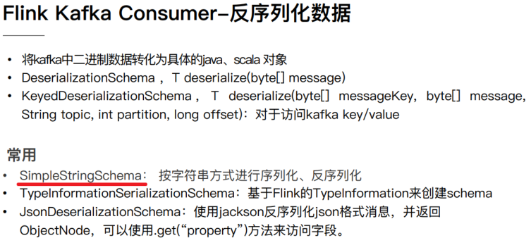


## 17-[掌握]-Kafka 数据源之编程实现

> 启动Zookeeper和Kafka集群，命令如下：

```ini
[root@node1 ~]# zookeeper-daemon.sh start
[root@node1 ~]# kafka-daemon.sh start

[root@node1 ~]# /export/server/kafka/bin/kafka-topics.sh --list --bootstrap-server node1.itcast.cn:9092

[root@node1 ~]# /export/server/kafka/bin/kafka-topics.sh --create --topic flink-topic --bootstrap-server node1.itcast.cn:9092 --replication-factor 1 --partitions 3

[root@node1 ~]# /export/server/kafka/bin/kafka-console-producer.sh --topic flink-topic --broker-list node1.itcast.cn:9092

/export/server/kafka/bin/kafka-console-producer.sh --topic flink-topic --broker-list node1.itcast.cn:9092,node2.itcast.cn:9092,node3.itcast.cn:9092
```


> 编程实现从Kafka消费数据，演示代码如下：

```scala
package cn.itcast.flink.source.kafka;

import org.apache.flink.api.common.serialization.SimpleStringSchema;
import org.apache.flink.streaming.api.datastream.DataStreamSource;
import org.apache.flink.streaming.api.environment.StreamExecutionEnvironment;
import org.apache.flink.streaming.connectors.kafka.FlinkKafkaConsumer;

import java.util.Properties;

/**
 * Flink从Kafka消费数据，指定topic名称和反序列化类
 */
public class StreamSourceKafkaDemo {

	public static void main(String[] args) throws Exception {
		// 1. 执行环境-env
		StreamExecutionEnvironment env = StreamExecutionEnvironment.getExecutionEnvironment() ;
		env.setParallelism(1) ; // 代码中设置全局并行度

		// 2. 数据源-source
		// 从Kafka消费数据时，设置参数值
		Properties props = new Properties() ;
		props.setProperty("bootstrap.servers", "node1.itcast.cn:9092");
		props.setProperty("group.id", "test-1001");
		// 传递参数，创建FlinkKafkaConsumer实例对象
		FlinkKafkaConsumer<String> kafkaConsumer = new FlinkKafkaConsumer<String>(
			"flink-topic", //
			new SimpleStringSchema(), //
			props
		) ;
		// 从Kafka消费数据，设置Source Operator并行度为3，优先级高于全局设置并行度
		DataStreamSource<String> kafkaDataStream = env.addSource(kafkaConsumer).setParallelism(3);

		// 3. 数据转换-transformation
		// 4. 数据终端-sink
		kafkaDataStream.printToErr();

		// 5. 触发执行-execute
		env.execute(StreamSourceKafkaDemo.class.getSimpleName()) ;
	}

}

```

> 其中最核心的部分就是：创建`FlinkKafkaConsumer`对象，传递参数值
>


## 18-[掌握]-Kafka 数据源之消费起始位置

​				从Kafka 消费数据时，可以设置从Kafka Topic中哪个偏移量位置开始消费数据，默认情况下，第一次运行，从Kafka Topic==最大偏移量==开始消费数据。


> - 第一、`earliest`：从最起始位置开始消费，当然不一定是从0开始，因为如果数据过期就清掉
>   了，所以可以理解为从现存的数据里最小位置开始消费；
> - 第二、`latest`：从最末位置开始消费；
> - 第三、`per-partition assignment`：对每个分区都指定一个offset，再从offset位置开始消费
>
> [在Kafka Consumer 参数中，有一个参数，可以进行设置，表示从哪里开始消费读取数据。]()

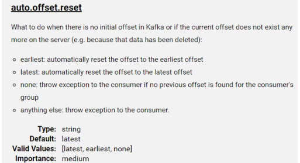


​		Flink 提供KafkaConnector连接器中提供`5种方式`，指定从哪里开始消费数据。默认情况下，==从Kafka消费数据时，采用的是：latest，最新偏移量开始消费数据==。

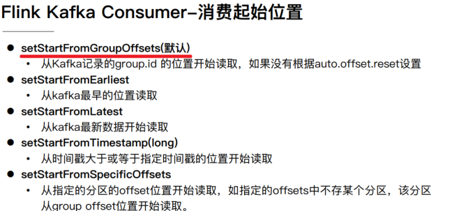

> - 1）、`setStartFromGroupOffsets`：
>   - 默认值设置，仅仅针对Flink Kafka Connector
>   - 从groupId上次消费数据记录开始消费，将上次消费偏移量存储在topic【`__consumer_offsets`】，如果消费组时第一次消费数据，从最大偏移量开始消费。
> - 2）、`setStartFromEarliest`：从最小偏移量消费数据
> - 3）、`setStartFromLatest`：从最大偏移量消费数据
> - 4）、`setStartFromTimestamp`：消费每条数据时间戳大于指定时间戳
> - 5）、`setStartFromSpecificOffsets`：从指定偏移量开始消费数据，偏移量值大于 最小偏移量，小于最大偏移量
>

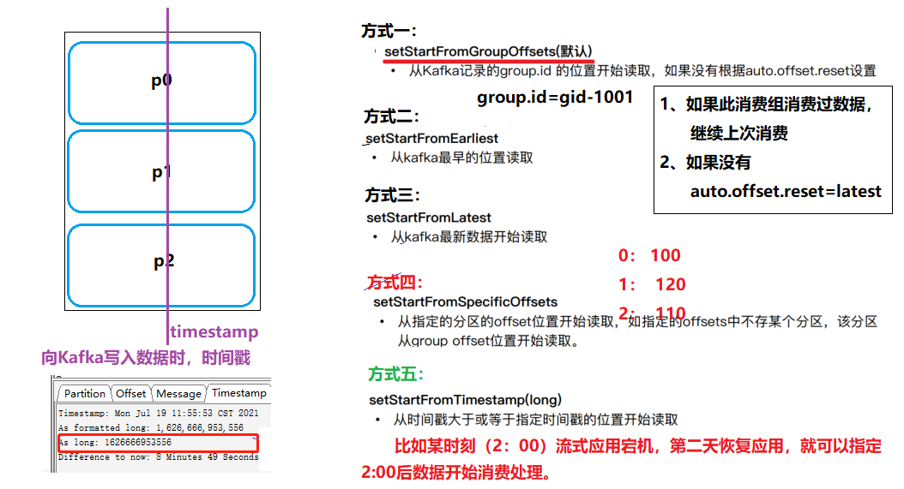

> [在代码中设置消费数据起始位置相关API如下所示：]()

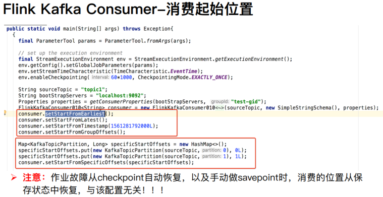

[上面所设置消费偏移量位置，表示不考虑流式程序从Checkpoint检查点或保存点SavePoint恢复。]()

> 编程演示，Flink从Kafka消费数据，指定偏移量，代码如下所示：

```java
package cn.itcast.flink.source.kafka;

import org.apache.flink.api.common.serialization.SimpleStringSchema;
import org.apache.flink.streaming.api.datastream.DataStreamSource;
import org.apache.flink.streaming.api.environment.StreamExecutionEnvironment;
import org.apache.flink.streaming.connectors.kafka.FlinkKafkaConsumer;
import org.apache.flink.streaming.connectors.kafka.internals.KafkaTopicPartition;

import java.util.HashMap;
import java.util.Map;
import java.util.Properties;

/**
 * Flink从Kafka消费数据，指定topic名称和反序列化类，可以指定消费数据开始偏移量
 */
public class StreamSourceKafkaOffsetDemo {

	public static void main(String[] args) throws Exception {
		// 1. 执行环境-env
		StreamExecutionEnvironment env = StreamExecutionEnvironment.getExecutionEnvironment() ;
		env.setParallelism(1) ; // 代码中设置全局并行度

		// 2. 数据源-source
		// 从Kafka消费数据时，设置参数值
		Properties props = new Properties() ;
		props.setProperty("bootstrap.servers", "node1.itcast.cn:9092");
		props.setProperty("group.id", "test-1001");
		// 传递参数，创建FlinkKafkaConsumer实例对象
		FlinkKafkaConsumer<String> kafkaConsumer = new FlinkKafkaConsumer<String>(
			"flink-topic", //
			new SimpleStringSchema(), //
			props
		) ;
		// TODO: 1、Flink从topic中最初的数据开始消费
		//kafkaConsumer.setStartFromEarliest() ;

		// TODO: 2、Flink从topic中最新的数据开始消费
		//kafkaConsumer.setStartFromLatest();

		// TODO: 3、Flink从topic中指定的group上次消费的位置开始消费，所以必须配置group.id参数
		//kafkaConsumer.setStartFromGroupOffsets() ;

		// TODO: 4、Flink从topic中指定的offset开始，这个比较复杂，需要手动指定offset
		Map<KafkaTopicPartition, Long> offsets = new HashMap<>();
		offsets.put(new KafkaTopicPartition("flink-topic", 0), 1L);
		offsets.put(new KafkaTopicPartition("flink-topic", 1), 8L);
		offsets.put(new KafkaTopicPartition("flink-topic", 2), 5L);
		kafkaConsumer.setStartFromSpecificOffsets(offsets);


		// 从Kafka消费数据，设置Source Operator并行度为3，优先级高于全局设置并行度
		DataStreamSource<String> kafkaDataStream = env.addSource(kafkaConsumer).setParallelism(3);

		// 3. 数据转换-transformation
		// 4. 数据终端-sink
		kafkaDataStream.printToErr();

		// 5. 触发执行-execute
		env.execute(StreamSourceKafkaOffsetDemo.class.getSimpleName()) ;
	}

}
```


## 19-[掌握]-Kafka 数据源之Topic和分区发现

实际的生产环境中可能有这样一些需求，比如：

> - 1）、场景一：有一个 Flink 作业需要将五份数据聚合到一起，五份数据对应五个 kafka topic，随
>着业务增长，**新增一类数据，同时新增了一个 kafka topic**，如何在==不重启作业==的情况下作业
> 自动感知新的 topic。==新增TOPIC数据，如何Flink Job感知==

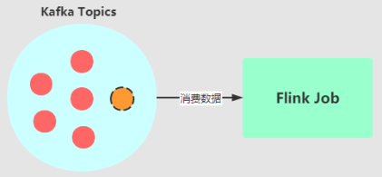


> - 2）、场景二：作业从一个固定的Kafka topic 读数据，开始该 topic 有7 个 partition，但随着
>   业务的增长数据量变大，需要对**Kafka partition 个数进行扩容**，由 7 个扩容到 14。该情况
>   下如何在==不重启作业==情况下动态感知新扩容的 partition？==对Topic增加分区，如何Flink job感知==

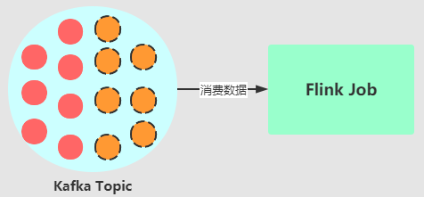


> Flink Kafka Source数据源，提供对应机制：

https://ci.apache.org/projects/flink/flink-docs-release-1.10/dev/connectors/kafka.html#kafka-consumers-topic-and-partition-discovery

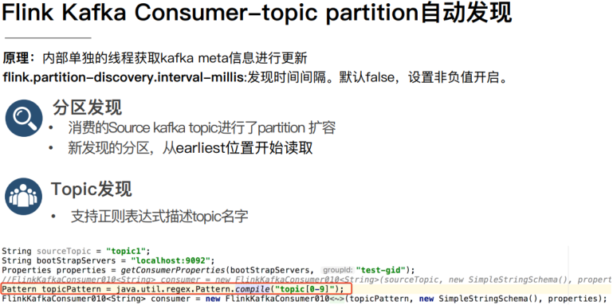

1）、构建 FlinkKafkaConsumer 时的 `properties` 中设置
`flink.partition-discovery.interval-millis` 参数为非负值，==表示开启动态发现的开关，及设置的时间间隔==，启动一个单独的线程定期去Kafka获取最新的meta信息。


2）、对于新增Topic来说，可以设置消费Topic名称时，采用正则表达式即可

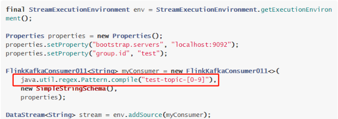


## 20-[了解]-数据转换之函数功能概述

> Flink流计算DataStream 转换函数，有一部分与批处理DataSet API类似，下图展示`DataStream`转换关系：

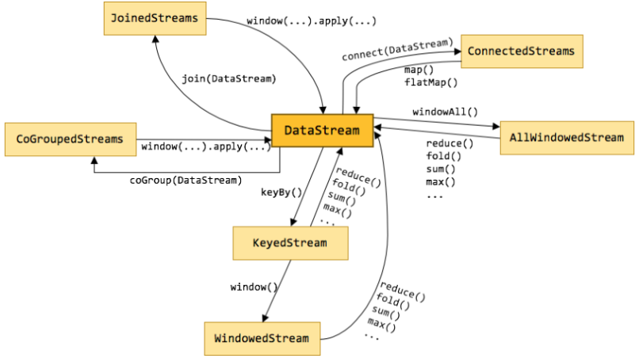

```
1、DataStream先分组keyBy，然后聚合
	分组keyBy后，要么直接聚合操作，要么窗口window再聚合
	
2、DataStream 直接窗口Window，再聚合操作

3、2个DataStream流关联
	join
	connect
	coCroup
```


> 从DataStream数据流转换角度看到Transformation函数，有如下四类操作：

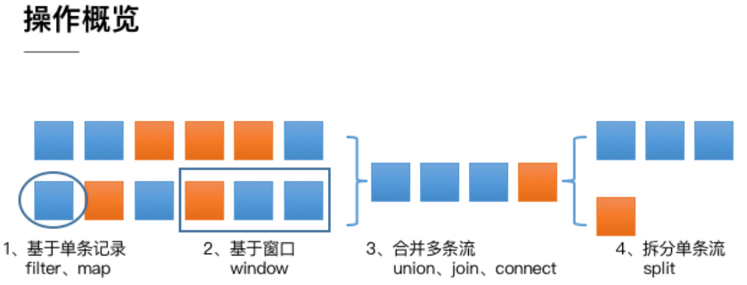

> - 1）、第一类是对于`单条记录的操作`，比如筛除掉不符合要求的记录（Filter 操作），或者将每条记录都做一个转换（Map 操作）
> - 2）、第二类是对`多条记录的操作`。比如说统计一个小时内的订单总成交量，就需要将一个小时内的所有订单记录的成交量加到一起。为了支持这种类型的操作，就得通过 Window 将需要的记录关联到一起进行处理
> - 3）、第三类是对`多个流进行操作并转换为单个流`。例如，多个流可以通过 Union、Join 或Connect 等操作合到一起。这些操作合并的逻辑不同，但是它们最终都会产生了一个新的统一的流，从而可以进行一些跨流的操作。
> - 4）、第四类是DataStream支持与合并对称的`拆分操作`，即`把一个流按一定规则拆分为多个流`（Split 操作），每个流是之前流的一个子集，这样我们就可以对不同的流作不同的处理。
>

​	DataStream Transformation API使用文档：https://ci.apache.org/projects/flink/flink-docs-release-1.10/dev/stream/operators/index.html#datastream-transformations


## 21-[掌握]-数据转换之keyBy函数 

​				`keyBy`函数表示：==按照指定的key来对流中的数据进行分组==，分组后流称为`KeyedStream`，要么聚合操作（调用reduce、fold或aggregate函数等等），要么进行窗口操作window。

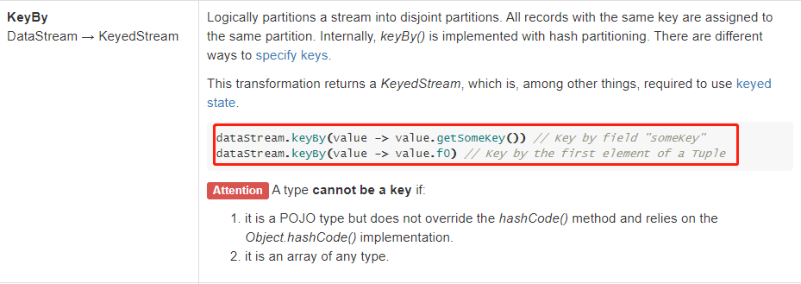

> [		在Flink中如果是批处理，分组使用函数：`groupBy`，从Flink 1.12以后开始，由于流批一体，无论是流计算还是批处理，分组函数：`keyBy`。]()


​			在使用keyBy函数时，可以指定`下标索引`（数据类型为元组）、指定`属性名称`（数据类型为JavaBean）或指定`KeySelector选择器`。


> 案例代码演示，从TCP Socket消费数据，进行词频统计，先过滤和分词，再分组和聚合。

```java
package cn.itcast.flink.transformation;

import org.apache.flink.api.common.functions.FlatMapFunction;
import org.apache.flink.api.java.functions.KeySelector;
import org.apache.flink.api.java.tuple.Tuple2;
import org.apache.flink.streaming.api.datastream.* ;
import org.apache.flink.streaming.api.environment.StreamExecutionEnvironment;
import org.apache.flink.util.Collector;

/**
 * 基于 Flink 流计算引擎：从TCP Socket消费数据，实时词频统计WordCount
 *          TODO: flatMap（直接二元组）和KeySelector选择器、sum函数聚合
 */
public class _09StreamKeyByDemo {

	/**
	 * 定义静态内部类，实现接口
	 */
	private static class SplitMapFunction implements FlatMapFunction<String, Tuple2<String, Integer>> {
		@Override
		public void flatMap(String line, Collector<Tuple2<String, Integer>> out) throws Exception {
			for (String word : line.trim().split("\\s+")) {
				out.collect(Tuple2.of(word, 1));
			}
		}
	}

	public static void main(String[] args) throws Exception {
		// 1. 执行环境-env
		StreamExecutionEnvironment env = StreamExecutionEnvironment.getExecutionEnvironment();
		env.setParallelism(2) ;

		// 2. 数据源-source
		DataStreamSource<String> inputDataStream = env.socketTextStream("node1.itcast.cn", 9999);

		// 3. 数据转换-transformation
		SingleOutputStreamOperator<Tuple2<String, Integer>> resultDataStream = inputDataStream
			// 3-1. 过滤
			.filter(line -> null != line && line.trim().length() > 0)
			// 3-2. 分词，转换二元组
			.flatMap(new SplitMapFunction())
			// 3-3. 分组和求和
			.keyBy(new KeySelector<Tuple2<String, Integer>, String>() {
				@Override
				public String getKey(Tuple2<String, Integer> tuple) throws Exception {
					return tuple.f0;
				}
			}).sum(1);

		// 4. 数据终端-sink
		resultDataStream.printToErr();

		// 5. 触发执行
		env.execute(_09StreamKeyByDemo.class.getSimpleName());
	}

}
```


## 22-[掌握]-数据转换之union和connect函数 

> - 1）`union`函数：可以`合并多个同类型的数据流`，并生成同类型的数据流，即可以将DataStream[T]合并为一个新的DataStream[T]。
>

[数据将按照先进先出（First In First Out）的模式合并，且不去重。]()

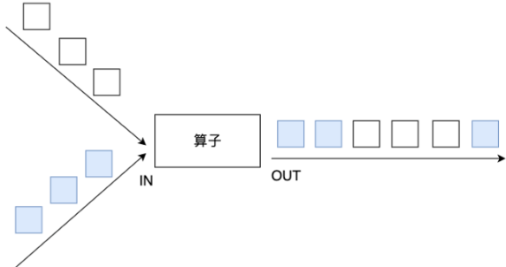


> - 2）、`connect`函数：提供了和union类似的功能，`用来连接两个数据流`，且2个数据流数据类型可不一样

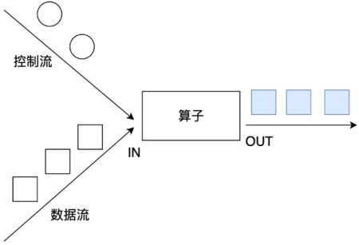

```ini
1、connect只能连接两个数据流，union可以连接多个数据流

2、connect所连接的两个数据流的数据类型可以不一致，union所连接的两个数据流的数据类型必须一致
```


> 案例演示，分别对2个流DataStream进行union和connect操作

- 将两个String类型的流进行`union`；
- 将一个String类型和一个Long类型的流进行`connect`；

```scala
package cn.itcast.flink.transformation;

import org.apache.flink.streaming.api.datastream.DataStream;
import org.apache.flink.streaming.api.datastream.DataStreamSource;
import org.apache.flink.streaming.api.datastream.SingleOutputStreamOperator;
import org.apache.flink.streaming.api.environment.StreamExecutionEnvironment;
import org.apache.flink.streaming.api.functions.co.CoMapFunction;

/**
 * Flink 流计算中转换函数：合并union和连接connect
 */
public class StreamUnionConnectDemo {

	public static void main(String[] args) throws Exception {
		// 1. 执行环境-env
		StreamExecutionEnvironment env = StreamExecutionEnvironment.getExecutionEnvironment();
		env.setParallelism(1) ;

		// 2. 数据源-source
		DataStreamSource<String> dataStream01 = env.fromElements("A", "B", "C", "D");
		DataStreamSource<String> dataStream02 = env.fromElements("aa", "bb", "cc", "dd");
		DataStreamSource<Integer> dataStream03 = env.fromElements(1, 2, 3, 4);

		// 3. 数据转换-transformation
		// TODO: 两个流进行union
		DataStream<String> unionDataStream = dataStream01.union(dataStream02);
		unionDataStream.printToErr();

		// TODO: 两个流进行连接
		SingleOutputStreamOperator<String> connectDataStream = dataStream01
			.connect(dataStream03)
			.map(new CoMapFunction<String, Integer, String>() {
				// 对第1个流进行map处理
				@Override
				public String map1(String value) throws Exception {
					return "map1 -> " + value;
				}
				// 对第2个流进行map处理
				@Override
				public String map2(Integer value) throws Exception {
					return "map2 -> " + value;
				}
			});
		connectDataStream.print() ;

		// 4. 数据终端-sink

		// 5. 触发执行-execute
		env.execute(StreamUnionConnectDemo.class.getSimpleName()) ;
	}

}
```


## 23-[了解]-数据转换之split和select函数 

> ​		在Flink流计算中，提供API函数，将1个流分割为多个流，使用`split`函数和`select`函数。

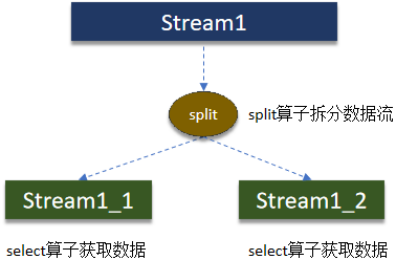


> `Split`就是将一个流分成多个流，`Select`就是获取分流后对应的数据

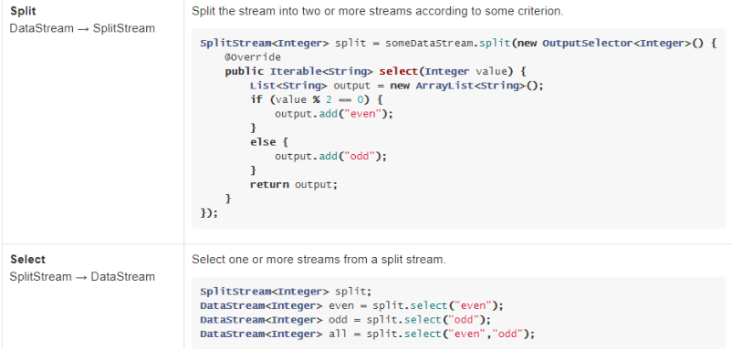

[DataStream中split函数，分割流的本质：给DataStream流中`每条数据打上标签Tag`，最后依据标签Tag获取具体分割的流数据。]()


> 需求：对流中的数据**按照奇数和偶数进行分流**，并获取分流后的数据

```java
package cn.itcast.flink.transformation;

import org.apache.flink.streaming.api.collector.selector.OutputSelector;
import org.apache.flink.streaming.api.datastream.DataStream;
import org.apache.flink.streaming.api.datastream.DataStreamSource;
import org.apache.flink.streaming.api.datastream.SplitStream;
import org.apache.flink.streaming.api.environment.StreamExecutionEnvironment;

import java.util.Arrays;

/**
 * Flink 流计算中转换函数：split流的拆分和select流的选择
 */
public class StreamSplitSelectDemo {

	public static void main(String[] args) throws Exception {
		// 1. 执行环境-env
		StreamExecutionEnvironment env = StreamExecutionEnvironment.getExecutionEnvironment();
		env.setParallelism(1) ;

		// 2. 数据源-source
		DataStreamSource<Long> dataStream = env.generateSequence(1, 10);

		// 3. 数据转换-transformation
		// TODO: 按照奇数和偶数分割流
		SplitStream<Long> splitDataStream = dataStream.split(new OutputSelector<Long>() {
			@Override
			public Iterable<String> select(Long value) {
				if (value % 2 == 0) {
					return Arrays.asList("even");
				} else {
					return Arrays.asList("odd");
				}
			}
		});
		// TODO: 使用select函数，依据名称获取分割流
		DataStream<Long> evenDataStream = splitDataStream.select("even");
		evenDataStream.printToErr();

		DataStream<Long> oddDataStream = splitDataStream.select("odd");
		oddDataStream.print();

		// 4. 数据终端-sink

		// 5. 触发执行-execute
		env.execute(StreamSplitSelectDemo.class.getSimpleName()) ;
	}

}
```


## 24-[掌握]-数据转换之Side Outputs侧边流 

> 分割流`函数split`已经过时，Flink提供：`侧边流SideOutput`方式，可以将1个流划分为多个流。

https://ci.apache.org/projects/flink/flink-docs-release-1.10/dev/stream/side_output.html


- 第1步、定义输出标签`OutputTag`
  - `OutputTag<String> outputTag = new OutputTag<String>("side-output") {};`
  - 比如需要输出2个流，定义2个OutputTag标签
- 第2步、调用DataStream中`process`底层处理函数，进行判断，划分OutputTag。

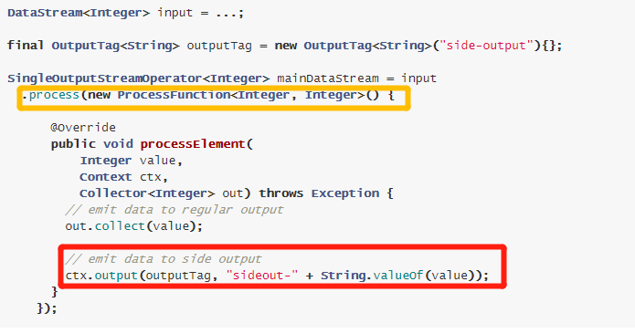


> 案例演示：对流中的数据**按照奇数和偶数进行分流**，并获取分流后的数据

```scala
package cn.itcast.flink.transformation;

import org.apache.flink.streaming.api.collector.selector.OutputSelector;
import org.apache.flink.streaming.api.datastream.DataStream;
import org.apache.flink.streaming.api.datastream.DataStreamSource;
import org.apache.flink.streaming.api.datastream.SingleOutputStreamOperator;
import org.apache.flink.streaming.api.datastream.SplitStream;
import org.apache.flink.streaming.api.environment.StreamExecutionEnvironment;
import org.apache.flink.streaming.api.functions.ProcessFunction;
import org.apache.flink.util.Collector;
import org.apache.flink.util.OutputTag;

import java.util.Arrays;

/**
 * Flink 流计算中转换函数：使用侧边流SideOutputs
 */
public class StreamSideOutputsDemo {

	public static void main(String[] args) throws Exception {
		// 1. 执行环境-env
		StreamExecutionEnvironment env = StreamExecutionEnvironment.getExecutionEnvironment();
		env.setParallelism(1) ;

		// 2. 数据源-source
		DataStreamSource<Long> dataStream = env.generateSequence(1, 10);

		// 3. 数据转换-transformation
		// TODO: 第1步、定义OutputTag
		OutputTag<String> oddTag = new OutputTag<String>("odd-tag") {};
		OutputTag<String> evenTag = new OutputTag<String>("even-tag") {};
		// TODO: 第2步、调用process函数，划分OutputTag
		SingleOutputStreamOperator<String> sideOutputDataStream = dataStream.process(new ProcessFunction<Long, String>() {
			@Override
			public void processElement(Long value,
			                           Context ctx,
			                           Collector<String> out) throws Exception {
				// 将数据输出，该怎么输出，还是怎么输出
				out.collect("regular: " + value);

				// 判断数据，进行侧边流输出
				if(value % 2 == 0){
					ctx.output(evenTag, "even: " + value);
				}else {
					ctx.output(oddTag, "odd: " + value);
				}
			}
		});
		// 打印本身流的数据
		sideOutputDataStream.printToErr() ;
		// 获取侧边流，进行打印
		DataStream<String> evenDataStream = sideOutputDataStream.getSideOutput(evenTag);
		evenDataStream.print();

		DataStream<String> oddDataStream = sideOutputDataStream.getSideOutput(oddTag);
		oddDataStream.printToErr();

		// 4. 数据终端-sink

		// 5. 触发执行-execute
		env.execute(StreamSideOutputsDemo.class.getSimpleName()) ;
	}

}

```


## 25-[理解]-数据转换之DataStream 分区 

> ​		在Flink流计算中DataStream提供一些列分区函数

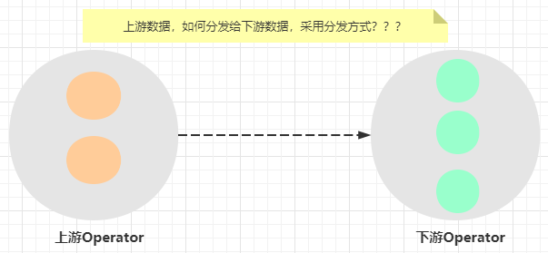


> 在DataStream函数中提供7种方式，具体如下所示：


> `rescale`分区，基于上下游Operator并行度，将记录以循环的方式输出到下游Operator每个实例。

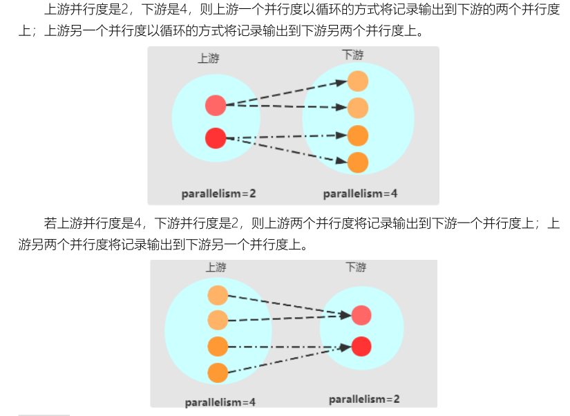

> 案例演示：

```java
package cn.itcast.flink.transformation;

import org.apache.flink.api.common.functions.Partitioner;
import org.apache.flink.api.common.functions.RichMapFunction;
import org.apache.flink.api.java.tuple.Tuple2;
import org.apache.flink.streaming.api.datastream.DataStream;
import org.apache.flink.streaming.api.datastream.DataStreamSource;
import org.apache.flink.streaming.api.environment.StreamExecutionEnvironment;

/**
 * Flink 流计算中转换函数：对流数据进行分区，函数如下：
 *      global、broadcast、forward、shuffle、rebalance、rescale、partitionCustom
 */
public class StreamRepartitionDemo {

	public static void main(String[] args) throws Exception {
		// 1. 执行环境-env
		StreamExecutionEnvironment env = StreamExecutionEnvironment.getExecutionEnvironment();
		env.setParallelism(2);

		// 2. 数据源-source
		DataStreamSource<Tuple2<Integer, String>> dataStream = env.fromElements(
			Tuple2.of(1, "a"), Tuple2.of(2, "b"), Tuple2.of(3, "c"), Tuple2.of(4, "d")
		);
		//dataStream.printToErr();

		// 3. 数据转换-transformation
		// TODO: 1、global函数，将所有数据发往1个分区Partition
		DataStream<Tuple2<Integer, String>> globalDataStream = dataStream.global();
		// globalDataStream.print();

		// TODO: 2、broadcast函数， 广播数据
		DataStream<Tuple2<Integer, String>> broadcastDataStream = dataStream.broadcast();

		//broadcastDataStream.printToErr();
		// TODO: 3、forward函数，上下游并发一样时 一对一发送
		DataStream<Tuple2<Integer, String>> forwardDataStream = dataStream.forward();

		//forwardDataStream.print().setParallelism(1) ;
		// TODO: 4、shuffle函数，随机均匀分配
		DataStream<Tuple2<Integer, String>> shuffleDataStream = dataStream.shuffle();
		//shuffleDataStream.printToErr();

		// TODO: 5、rebalance函数，轮流分配
		DataStream<Tuple2<Integer, String>> rebalanceDataStream = dataStream.rebalance();
		//rebalanceDataStream.print() ;

		// TODO: 6、rescale函数，本地轮流分配
		DataStream<Tuple2<Integer, String>> rescaleDataStream = dataStream.rescale();
		//rescaleDataStream.printToErr();

		// TODO: 7、partitionCustom函数，自定义分区规则
		DataStream<Tuple2<Integer, String>> customDataStream = dataStream.partitionCustom(
			new Partitioner<Integer>() {
				@Override
				public int partition(Integer key, int numPartitions) {
					return key % 2;
				}
			},
			0
		);
		customDataStream
			.map(new RichMapFunction<Tuple2<Integer, String>, String>() {
				@Override
				public String map(Tuple2<Integer, String> tuple) throws Exception {
					int index = getRuntimeContext().getIndexOfThisSubtask();
					return index + ": " + tuple.toString();
				}
			})
			.printToErr();

		// 4. 数据终端-sink
		env.execute(StreamRepartitionDemo.class.getSimpleName());
	}
}

```


## 26-[了解]-数据终端之文件Sink 

> Flink流计算中数据终端Sink，既包含批处理支持Sink，又包含其他Sink。

https://ci.apache.org/projects/flink/flink-docs-release-1.10/dev/datastream_api.html#data-sinks


> 将流式数据写入文件方法：`writeAsText`和`writeAsCsv`，全部过时，提供新的Connector：`StreamingFileSink`


查看DataStream中`writeAsText`方法源码：


```
1、写入文件，API已经过时，不推荐使用
	writeAsText
	writeAsCsv
	
2、打印控制台，开发测试使用
	print，标准输出
	printToErr,错误输出
	
3、写入Socket
	很少使用
	
4、自定义数据终端Sink
	Sink接口：SinkFunction、RichSinkFunction
	datastream.addSink 添加流式数据输出Sink
	
	需求：Flink 流式计算程序，实时从Kafka消费数据（保险行业），将数据ETL转换，存储到HBase表
		Flink 1.10版本中，DataStream未提供与HBase集成Connector连接器
		自定实现SinkFunction接口，向HBase表写入数据即可
		https://www.jianshu.com/p/1c29750ed814
```

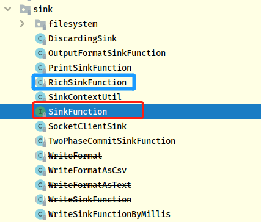


## 27-[理解]-数据终端之自定义Sink 

> 需求：将Flink集合中的数据集DataStream，通过自定义Sink保存到MySQL。

```SQL
CREATE DATABASE IF NOT EXISTS db_flink ;

USE db_flink ;

CREATE TABLE `t_student` (
`id` int(11) NOT NULL AUTO_INCREMENT,
`name` varchar(255) DEFAULT NULL,
`age` int(11) DEFAULT NULL,
PRIMARY KEY (`id`)
) ENGINE=InnoDB AUTO_INCREMENT=1 DEFAULT CHARSET=utf8;
```

[当自定义Flink中Sink时，需要实现接口：`SinkFunction`或`RichSinkFunction`]()

```java
package cn.itcast.flink.sink.custom;

import lombok.AllArgsConstructor;
import lombok.Data;
import lombok.NoArgsConstructor;
import org.apache.flink.configuration.Configuration;
import org.apache.flink.streaming.api.datastream.DataStreamSource;
import org.apache.flink.streaming.api.environment.StreamExecutionEnvironment;
import org.apache.flink.streaming.api.functions.sink.RichSinkFunction;

import java.sql.Connection;
import java.sql.DriverManager;
import java.sql.PreparedStatement;

/**
 * 案例演示：自定义Sink，将数据保存至MySQL表中，继承RichSinkFunction
 */
public class StreamSinkMySQLDemo {

	@Data
	@NoArgsConstructor
	@AllArgsConstructor
	private static class Student{
		private Integer id ;
		private String name ;
		private Integer age ;
	}

	/**
	 * 自定义Sink，将数据保存至MySQL表中
	 */
	private static class MySQLSink extends RichSinkFunction<Student> {
		// 定义变量
		Connection conn = null ;
		PreparedStatement pstmt = null ;

		@Override
		public void open(Configuration parameters) throws Exception {
			// a. 加载驱动类
			Class.forName("com.mysql.jdbc.Driver") ;
			// b. 获取连接
			conn = DriverManager.getConnection(
				"jdbc:mysql://node1.itcast.cn:3306/?useUnicode=true&characterEncoding=utf-8&useSSL=false",
				"root",
				"123456"
			);
			// c. 获取Statement对象
			pstmt = conn.prepareStatement("INSERT INTO db_flink.t_student (id, name, age) VALUES (?, ?, ?)") ;
		}

		@Override
		public void invoke(Student student, Context context) throws Exception {
			// a. 设置值，占位符
			pstmt.setInt(1, student.id);
			pstmt.setString(2, student.name);
			pstmt.setInt(3, student.age);
			// b. 插入
			pstmt.executeUpdate();
		}

		@Override
		public void close() throws Exception {
			if(null != pstmt){
				pstmt.close();
			}
			if(null != conn){
				conn.close();
			}
		}
	}

	public static void main(String[] args) throws Exception {
		// 1. 执行环境-env
		StreamExecutionEnvironment env = StreamExecutionEnvironment.getExecutionEnvironment();
		env.setParallelism(1) ;

		// 2. 数据源-source
		DataStreamSource<Student> inputDataStream = env.fromElements(
			new Student(13, "wangwu", 20),
			new Student(14, "zhaoliu", 19),
			new Student(15, "wangwu", 20),
			new Student(16, "zhaoliu", 19)
		);

		// 3. 数据转换-transformation
		
		// 4. 数据终端-sink
		// 4-1. 创建Sink对象实例
		MySQLSink sink = new MySQLSink();
		// 4-2. 添加sink
		inputDataStream.addSink(sink);

		// 5. 触发执行-execute
		env.execute(StreamSinkMySQLDemo.class.getSimpleName()) ;
	}

}
```


## 28-[掌握]-数据终端之Jdbc Sink 

从Flink 1.11版本开始，增加`JDBC Connector`连接器，可以将DataStream数据直接保存RDBMS表中。

https://ci.apache.org/projects/flink/flink-docs-release-1.11/dev/connectors/jdbc.html

> ​	1）、添加MAVEN依赖
>

```xml
<dependency>
  <groupId>org.apache.flink</groupId>
  <artifactId>flink-connector-jdbc_2.11</artifactId>
  <version>1.11.2</version>
</dependency>
```


> - 2）、官方案例：

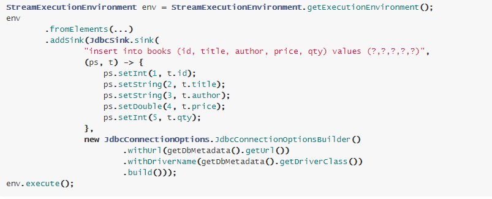


> 需求：==将Flink集合中的数据集DataStream，通过JDBC自定义Sink保存到MySQL。==

```scala
package cn.itcast.flink.sink.mysql;

import lombok.AllArgsConstructor;
import lombok.Data;
import lombok.NoArgsConstructor;
import org.apache.flink.connector.jdbc.JdbcConnectionOptions;
import org.apache.flink.connector.jdbc.JdbcSink;
import org.apache.flink.connector.jdbc.JdbcStatementBuilder;
import org.apache.flink.streaming.api.datastream.DataStreamSource;
import org.apache.flink.streaming.api.environment.StreamExecutionEnvironment;
import org.apache.flink.streaming.api.functions.sink.SinkFunction;

import java.sql.PreparedStatement;
import java.sql.SQLException;

/**
 * 案例演示：自定义Sink，将数据保存至MySQL表中，继承RichSinkFunction
 */
public class StreamSinkJdbcDemo {

	@Data
	@NoArgsConstructor
	@AllArgsConstructor
	private static class Student{
		private Integer id ;
		private String name ;
		private Integer age ;
	}


	public static void main(String[] args) throws Exception {
		// 1. 执行环境-env
		StreamExecutionEnvironment env = StreamExecutionEnvironment.getExecutionEnvironment();
		env.setParallelism(1) ;

		// 2. 数据源-source
		DataStreamSource<Student> inputDataStream = env.fromElements(
			new Student(23, "wangwu2", 20),
			new Student(24, "zhaoliu2", 19),
			new Student(25, "wangwu2", 20),
			new Student(26, "zhaoliu2", 19)
		);

		// 3. 数据转换-transformation
		// 4. 数据终端-sink
		// 创建JdbcSink对象
		SinkFunction<Student> jdbcSink = JdbcSink.sink(
			"insert into db_flink.t_student (id, name, age) values (?, ?, ?)", // 插入SQL语句
			new JdbcStatementBuilder<Student>() {
				@Override
				public void accept(PreparedStatement pstmt, Student student) throws SQLException {
					pstmt.setInt(1, student.id);
					pstmt.setString(2, student.name);
					pstmt.setInt(3, student.age);
				}
			},  // 设置PreparedStatement对象中值
			new JdbcConnectionOptions.JdbcConnectionOptionsBuilder()
				.withDriverName("com.mysql.jdbc.Driver")
				.withUrl("jdbc:mysql://node1.itcast.cn:3306/?useUnicode=true&characterEncoding=utf-8&useSSL=false")
				.withUsername("root")
				.withPassword("123456")
				.build()
		);

		// 设置JdbcSink对象
		inputDataStream.addSink(jdbcSink);

		// 5. 触发执行-execute
		env.execute(StreamSinkJdbcDemo.class.getSimpleName()) ;
	}

}
```


## 29-[掌握]-数据终端之Kafka Sink 

​		Flink提供Connector连接器中支持Kafka的`Source数据源`和`数据终端Sink`。

https://ci.apache.org/projects/flink/flink-docs-release-1.11/dev/connectors/kafka.html#kafka-producer

> ==Flink Kafka Sink核心类：`FlinkKafkaProducer`==

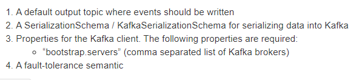

```
1）、topic 名称
2）、序列化
	将Java对象转byte[]
3）、Kafka Server地址信息

4）、容错恢复配置
	State和Checkpoint
```

> 官方提供案例：[案例代码，有错误，有瑕疵，`new SimpleStringSchema()`]()
>

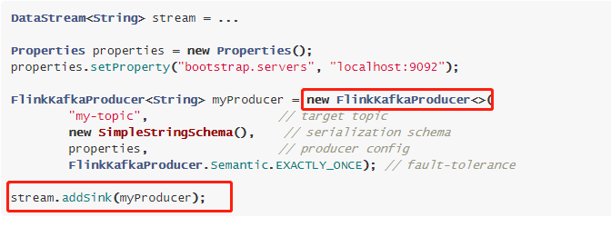


> 准备工作：启动集群、创建Topic，命令如下：

```ini
[root@node1 ~]# zookeeper-daemon.sh start
[root@node1 ~]# kafka-daemon.sh start

[root@node1 ~]# /export/server/kafka/bin/kafka-topics.sh --list --bootstrap-server node1.itcast.cn:9092

[root@node1 ~]# /export/server/kafka/bin/kafka-topics.sh --create --topic flink-topic --bootstrap-server node1.itcast.cn:9092 --replication-factor 1 --partitions 3

[root@node1 ~]# /export/server/kafka/bin/kafka-console-consumer.sh --topic flink-topic --bootstrap-server node1.itcast.cn:9092
```


> 案例演示：==自定义Source数据源，产生交易订单数据，将其转换为JSON字符串，实时保存到Kafka topic==

```scala
package cn.itcast.flink.sink.kafka;

import com.alibaba.fastjson.JSON;
import lombok.AllArgsConstructor;
import lombok.Data;
import lombok.NoArgsConstructor;
import org.apache.flink.api.common.functions.MapFunction;
import org.apache.flink.api.common.serialization.SimpleStringSchema;
import org.apache.flink.streaming.api.datastream.DataStreamSource;
import org.apache.flink.streaming.api.datastream.SingleOutputStreamOperator;
import org.apache.flink.streaming.api.environment.StreamExecutionEnvironment;
import org.apache.flink.streaming.api.functions.source.RichParallelSourceFunction;
import org.apache.flink.streaming.connectors.kafka.FlinkKafkaProducer;
import org.apache.flink.streaming.connectors.kafka.KafkaSerializationSchema;
import org.apache.kafka.clients.producer.ProducerRecord;

import javax.annotation.Nullable;
import java.nio.charset.StandardCharsets;
import java.util.Properties;
import java.util.Random;
import java.util.UUID;
import java.util.concurrent.TimeUnit;

/**
 * 案例演示：将数据保存至Kafka Topic中，直接使用官方提供Connector
 *      /export/server/kafka/bin/kafka-console-consumer.sh --bootstrap-server node1.itcast.cn:9092 --topic flink-topic
 */
public class StreamSinkKafkaDemo {

	/**
	 * 自定义实现Kafka Serialization Schema接口，实现将消息Message转换byte[]
	 */
	private static class KafkaSchema implements KafkaSerializationSchema<String> {
		private String topic ;

		public KafkaSchema(String topic) {
			this.topic = topic;
		}

		public String getTopic() {
			return topic;
		}

		public void setTopic(String topic) {
			this.topic = topic;
		}

		@Override
		public ProducerRecord<byte[], byte[]> serialize(String element, @Nullable Long timestamp) {
			return new ProducerRecord<byte[], byte[]>(topic, element.getBytes(StandardCharsets.UTF_8));
		}
	}


	public static void main(String[] args) throws Exception {
		// 1. 执行环境-env
		StreamExecutionEnvironment env = StreamExecutionEnvironment.getExecutionEnvironment();
		env.setParallelism(1) ;

		// 2. 数据源-source
		DataStreamSource<Order> orderDataStream = env.addSource(new OrderSource());

		// 3. 数据转换-transformation：将Order订单对象转换JSON字符串
		SingleOutputStreamOperator<String> jsonDataStream = orderDataStream.map(new MapFunction<Order, String>() {
			@Override
			public String map(Order order) throws Exception {
				return JSON.toJSONString(order);
			}
		});

		// 4. 数据终端-sink
		// a. 向Kafka写入数据时配置参数
		Properties props = new Properties();
		props.setProperty("bootstrap.servers", "node1.itcast.cn:9092");
		// b. 创建FlinkKafkaProducer对象
		/*
			public FlinkKafkaProducer(
				String defaultTopic,
				KafkaSerializationSchema<IN> serializationSchema,
				Properties producerConfig,
				FlinkKafkaProducer.Semantic semantic
			)
		 */
		String topic = "flink-topic" ;
		FlinkKafkaProducer<String> kafkaProducer = new FlinkKafkaProducer<String>(
			topic, //
			new KafkaSchema(topic), //
			props, //
			FlinkKafkaProducer.Semantic.EXACTLY_ONCE //
		);

		// c.设置Sink
		jsonDataStream.addSink(kafkaProducer);

		// 5. 触发执行-execute
		env.execute(StreamSinkKafkaDemo.class.getSimpleName()) ;
	}


	@Data
	@NoArgsConstructor
	@AllArgsConstructor
	public static class Order {
		private String id;
		private Integer userId;
		private Double money;
		private Long orderTime;
	}

	/**
	 * 自定义数据源：每隔1秒产生1条交易订单数据
	 */
	private static class OrderSource extends RichParallelSourceFunction<Order> {
		// 定义标识变量，表示是否产生数据
		private boolean isRunning = true;

		// 模拟产生交易订单数据
		@Override
		public void run(SourceContext<Order> ctx) throws Exception {
			Random random = new Random() ;
			while (isRunning){
				// 构建交易订单数据
				Order order = new Order(
					UUID.randomUUID().toString().substring(0, 18), //
					random.nextInt(2) + 1 , //
					random.nextDouble() * 100 ,//
					System.currentTimeMillis()
				);

				// 将数据输出
				ctx.collect(order);

				// 每隔1秒产生1条数据，线程休眠
				TimeUnit.SECONDS.sleep(1);
			}
		}

		@Override
		public void cancel() {
			isRunning = false ;
		}
	}

}
```


## 30-[掌握]-数据终端之StreamingFileSink


https://ci.apache.org/projects/flink/flink-docs-release-1.10/dev/connectors/streamfile_sink.html

​		`StreamingFileSink`是Flink1.7中推出的新特性，可以用来**将分区文件写入到支持 Flink FileSystem 接口的文件系统**中，==支持Exactly-Once语义==。

-  Streaming File Sink 会将数据写入到桶Bucket中。

  - 由于输入流可能是无界的，因此每个桶中的数据被划分为多个有限大小的文件。
  - 如何分桶是可以配置的，默认使用基于时间的分桶策略，这种策略每个小时创建一个新的桶，桶中包含的文件将记录所有该小时内从流中接收到的数据。

  

- 桶目录中的实际输出数据会被划分为多个部分文件（part file），每一个接收桶数据的 Sink Subtask ，至少包含一个部分文件（part file）。

  - 额外的部分文件（part file）将根据滚动策略创建，滚动策略是可以配置的。
  - 默认的策略是根据文件大小和超时时间来滚动文件。
  - 超时时间指打开文件的最长持续时间，以及文件关闭前的最长非活动时间。


> 第一、**文件编码格式**（`File Formats`）
>
> [StreamingFileSink 支持==行编码格式==和==批量编码格式==，比如 Apache Parquet 。]()

- [Row-encoded]() sink

  `StreamingFileSink.forRowFormat(basePath, rowEncoder)`

- [Bulk-encoded]() sink

  `StreamingFileSink.forBulkFormat(basePath, bulkWriterFactory)`

  - 列式存储：Parquet format

    ```xml
    <dependency>
      <groupId>org.apache.flink</groupId>
      <artifactId>flink-parquet_2.11</artifactId>
      <version>1.10.0</version>
    </dependency>
    ```

    

    

  - 序列存储：SequenceFile format

    ```xml
    <dependency>
      <groupId>org.apache.flink</groupId>
      <artifactId>flink-sequence-file</artifactId>
      <version>1.10.0</version>
    </dependency>
    ```

    


> 第三、**滚动策略** （`Rolling Policy`）

 		滚动策略 RollingPolicy 定义了指定的文件在何时关闭（closed）并将其变为 Pending 状态，随后变为 Finished 状态。处于 Pending 状态的文件会在下一次 Checkpoint 时变为 Finished 状态，通过设置 Checkpoint 间隔时间，可以控制部分文件（part file）对下游读取者可用的速度、大小和数量。	

- [DefaultRollingPolicy]()

  当超过最大桶大小（默认为 128 MB），或超过了滚动周期（默认为 60 秒），或未写入数据处于不活跃状态超时（默认为 60 秒）的时候，滚动文件；

  

- [OnCheckpointRollingPolicy]()

  当 checkpoint 的时候，滚动文件。


> 第三、**桶分配**

​		桶分配逻辑定义：如何将数据结构化为基本输出目录中的子目录，行格式和批量格式都使用DateTimeBucketAssigner 作为默认的分配器。[默认情况下，DateTimeBucketAssigner 基于系统默认时区每小时创建一个桶，格式如下：yyyy-MM-dd--HH 。日期格式（即桶的大小）和时区都可以手动配置。]()

- DateTimeBucketAssigner ：默认基于时间的分配器
- BasePathBucketAssigner ：将所有部分文件（part file）存储在基本路径中的分配器（单个全局桶）


> 第四、**part file配置项**
>
> [已经完成的文件和进行中的文件仅能通过文件名格式进行区分。]()


- [In-progress/Pending]()时文件名称：

  ` part-<subtaskIndex>-<partFileIndex>.inprogress.uid`

- [FINISHED]()时文件名称：

  `part-<subtaskIndex>-<partFileIndex>`

Flink 允许用户通过 **OutputFileConfig** 指定部分文件名的前缀和后缀，案例如下所示：


[使用 StreamingFileSink 时需要启用 Checkpoint ，每次做 Checkpoint 时写入完成。如果 Checkpoint 被禁用，部分文件（part file）将永远处于 'in-progress' 或 'pending' 状态，下游系统无法安全地读取。]()

> 案例演示：==编写Flink程序，自定义数据源产生交易订单数据，接收后的数据流式方式存储到hdfs==

```ini
1. 执行环境-env
	1-1.设置并行度为：3
	1-2.设置Checkpoint检查点，如果不设置，数据不会写入文件
	
2. 数据源-source
	自定义数据源，产生交易订单数据
	数据格式：e7057860-e88,u-14395,94.24,1630142114565
	
4. 数据终端-sink
	4-1.设置数据存储文件格式
	4-2. 设置输出文件大小滚动策略，什么时候产生新文件
	4-3. 设置文件的名称
	4-4. 添加Sink，设置并行度为：1
	
5.触发执行-execute
```

```scala
package cn.itcast.flink.sink.file;

import org.apache.flink.api.common.serialization.SimpleStringEncoder;
import org.apache.flink.core.fs.Path;
import org.apache.flink.streaming.api.datastream.DataStreamSource;
import org.apache.flink.streaming.api.environment.StreamExecutionEnvironment;
import org.apache.flink.streaming.api.functions.sink.filesystem.OutputFileConfig;
import org.apache.flink.streaming.api.functions.sink.filesystem.StreamingFileSink;
import org.apache.flink.streaming.api.functions.sink.filesystem.rollingpolicies.DefaultRollingPolicy;
import org.apache.flink.streaming.api.functions.source.ParallelSourceFunction;

import java.math.BigDecimal;
import java.math.RoundingMode;
import java.util.Random;
import java.util.UUID;
import java.util.concurrent.TimeUnit;

/**
 * Flink Stream 流计算，将DataStream 保存至文件系统，使用FileSystem Connector
 */
public class StreamSinkFileDemo {

	public static void main(String[] args) throws Exception {
		// 1. 执行环境-env
		StreamExecutionEnvironment env = StreamExecutionEnvironment.getExecutionEnvironment();
		env.setParallelism(3);
		// TODO: 设置Checkpoint目录
		env.enableCheckpointing(1000) ;

		// 2. 数据源-source
		DataStreamSource<String> lineDataStream = env.addSource(new ParallelSourceFunction<String>() {
			private boolean isRunning = true ;
			@Override
			public void run(SourceContext<String> ctx) throws Exception {
				Random random = new Random();
				while (isRunning){
					// 交易订单
					String orderId = UUID.randomUUID().toString().substring(0, 12) ;
					String userId = "u-" + (10000 + random.nextInt(10000)) ;
					Double orderMoney = new BigDecimal(random.nextDouble() * 100).setScale(2, RoundingMode.HALF_UP).doubleValue() ;
					String output = orderId + "," + userId + "," + orderMoney + "," + System.currentTimeMillis() ;
					// 输出
					ctx.collect(output);
					TimeUnit.MILLISECONDS.sleep(100);
				}
			}

			@Override
			public void cancel() {
				isRunning = false ;
			}
		});

		// 3. 数据转换-transformation
		// 4. 数据终端-sink
		StreamingFileSink<String> fileSink = StreamingFileSink
			// 4-1. 设置数据存储文件格式：row
			.forRowFormat(
				new Path("datas/flink/"), new SimpleStringEncoder<String>("UTF-8")
			)
			// 4-2. 设置输出文件大小滚动策略，什么时候产生新文件
			.withRollingPolicy(
				DefaultRollingPolicy.builder()
					.withRolloverInterval(TimeUnit.SECONDS.toMillis(5))
					.withInactivityInterval(TimeUnit.SECONDS.toMillis(10))
					.withMaxPartSize(2 * 1024 * 1024)
					.build()
			)
			// 4-3. 设置文件的名称
			.withOutputFileConfig(
				new OutputFileConfig("itcast", ".log")
			)
			.build();

		// 4-4. 添加Sink，设置并行度为1
		lineDataStream.addSink(fileSink).setParallelism(1) ;

		// 5. 触发执行
		env.execute(StreamSinkFileDemo.class.getSimpleName());
	}

}
```


## [附录]-创建Maven模块

> Maven Module模块工程结构


> Maven 工程POM文件中内容（依赖包）：

```xml
    <repositories>
        <repository>
            <id>apache.snapshots</id>
            <name>Apache Development Snapshot Repository</name>
            <url>https://repository.apache.org/content/repositories/snapshots/</url>
            <releases>
                <enabled>false</enabled>
            </releases>
            <snapshots>
                <enabled>true</enabled>
            </snapshots>
        </repository>
    </repositories>

    <properties>
        <project.build.sourceEncoding>UTF-8</project.build.sourceEncoding>
        <java.version>1.8</java.version>
        <maven.compiler.source>${java.version}</maven.compiler.source>
        <maven.compiler.target>${java.version}</maven.compiler.target>
        <flink.version>1.10.0</flink.version>
        <scala.version>2.11.12</scala.version>
        <scala.binary.version>2.11</scala.binary.version>
        <mysql.version>5.1.48</mysql.version>
    </properties>

    <dependencies>
        <dependency>
            <groupId>org.scala-lang</groupId>
            <artifactId>scala-library</artifactId>
            <version>${scala.version}</version>
        </dependency>
        <dependency>
            <groupId>org.apache.flink</groupId>
            <artifactId>flink-streaming-scala_${scala.binary.version}</artifactId>
            <version>${flink.version}</version>
        </dependency>
        <dependency>
            <groupId>org.apache.flink</groupId>
            <artifactId>flink-scala_${scala.binary.version}</artifactId>
            <version>${flink.version}</version>
        </dependency>
        <dependency>
            <groupId>org.apache.flink</groupId>
            <artifactId>flink-clients_${scala.binary.version}</artifactId>
            <version>${flink.version}</version>
        </dependency>

        <dependency>
            <groupId>org.apache.flink</groupId>
            <artifactId>flink-java</artifactId>
            <version>${flink.version}</version>
        </dependency>
        <dependency>
            <groupId>org.apache.flink</groupId>
            <artifactId>flink-streaming-java_${scala.binary.version}</artifactId>
            <version>${flink.version}</version>
        </dependency>

        <dependency>
            <groupId>org.apache.flink</groupId>
            <artifactId>flink-runtime-web_${scala.binary.version}</artifactId>
            <version>${flink.version}</version>
        </dependency>
        <dependency>
            <groupId>org.apache.flink</groupId>
            <artifactId>flink-connector-kafka_2.11</artifactId>
            <version>${flink.version}</version>
        </dependency>

        <dependency>
            <groupId>org.apache.flink</groupId>
            <artifactId>flink-connector-jdbc_2.11</artifactId>
            <version>1.11.0</version>
        </dependency>
        <dependency>
            <groupId>org.apache.flink</groupId>
            <artifactId>flink-shaded-hadoop-2-uber</artifactId>
            <version>2.7.5-10.0</version>
        </dependency>
        <dependency>
            <groupId>org.apache.bahir</groupId>
            <artifactId>flink-connector-redis_${scala.binary.version}</artifactId>
            <version>1.0</version>
        </dependency>

        <dependency>
            <groupId>mysql</groupId>
            <artifactId>mysql-connector-java</artifactId>
            <version>${mysql.version}</version>
        </dependency>
        <dependency>
            <groupId>com.alibaba</groupId>
            <artifactId>fastjson</artifactId>
            <version>1.2.68</version>
        </dependency>
        <dependency>
            <groupId>org.projectlombok</groupId>
            <artifactId>lombok</artifactId>
            <version>1.18.12</version>
        </dependency>

        <dependency>
            <groupId>org.slf4j</groupId>
            <artifactId>slf4j-log4j12</artifactId>
            <version>1.7.7</version>
            <scope>runtime</scope>
        </dependency>
        <dependency>
            <groupId>log4j</groupId>
            <artifactId>log4j</artifactId>
            <version>1.2.17</version>
            <scope>runtime</scope>
        </dependency>

    </dependencies>

    <build>
        <sourceDirectory>src/main/java</sourceDirectory>
        <testSourceDirectory>src/test/java</testSourceDirectory>
        <plugins>
            <!-- 编译插件 -->
            <plugin>
                <groupId>org.apache.maven.plugins</groupId>
                <artifactId>maven-compiler-plugin</artifactId>
                <version>3.5.1</version>
                <configuration>
                    <source>1.8</source>
                    <target>1.8</target>
                    <!--<encoding>${project.build.sourceEncoding}</encoding>-->
                </configuration>
            </plugin>
            <plugin>
                <groupId>org.apache.maven.plugins</groupId>
                <artifactId>maven-surefire-plugin</artifactId>
                <version>2.18.1</version>
                <configuration>
                    <useFile>false</useFile>
                    <disableXmlReport>true</disableXmlReport>
                    <includes>
                        <include>**/*Test.*</include>
                        <include>**/*Suite.*</include>
                    </includes>
                </configuration>
            </plugin>
            <!-- 打jar包插件(会包含所有依赖) -->
            <plugin>
                <groupId>org.apache.maven.plugins</groupId>
                <artifactId>maven-shade-plugin</artifactId>
                <version>2.3</version>
                <executions>
                    <execution>
                        <phase>package</phase>
                        <goals>
                            <goal>shade</goal>
                        </goals>
                        <configuration>
                            <filters>
                                <filter>
                                    <artifact>*:*</artifact>
                                    <excludes>
                                        <!--
                                        zip -d learn_spark.jar META-INF/*.RSA META-INF/*.DSA META-INF/*.SF -->
                                        <exclude>META-INF/*.SF</exclude>
                                        <exclude>META-INF/*.DSA</exclude>
                                        <exclude>META-INF/*.RSA</exclude>
                                    </excludes>
                                </filter>
                            </filters>
                            <transformers>
                                <transformer
                                        implementation="org.apache.maven.plugins.shade.resource.ManifestResourceTransformer">
                                    <!-- 可以设置jar包的入口类(可选) -->
                                    <!--
                                    <mainClass>com.itcast.flink.batch.FlinkBatchWordCount</mainClass>
                                    -->
                                </transformer>
                            </transformers>
                        </configuration>
                    </execution>
                </executions>
            </plugin>
        </plugins>
    </build>
```

